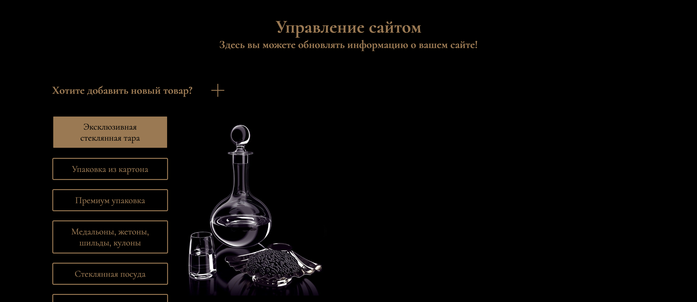

# Freelance заказ от компании "ООО Партнер" (копия без API)

## Разработчики проекта: [AshurovG], [tkoibaev]

## Стек технологий

- Frontend: React, Typescript, Redux Toolkit, SCSS modules, Vite, Framer-motion
- Backend: Node.js (Express), Typescript, PostgreSQL, Docker, Nginx
- Приложение развернуто на Ubuntu VPS, доступ закрыт. Зеракало доступно по [ссылке].

[AshurovG]: https://github.com/AshurovG
[tkoibaev]: https://github.com/tkoibaev
[ссылке]: https://ashurovg.github.io/partner_copy/

## Функционал приложения

- Просмотр различных категорий товаров
- Просмотр товаров из определенной категории
- Просмотр подробной информации о товаре
- Обратная связь с компанией через форму с отправкой на почту
- Редактирование данных сайтов через панель администратора
- Авторизация администратора

## Экраны приложения

### Главная страница

### Футер и форма обратной связи

### Навигационное меню

### Вход в режим администратора

### Сраница категорий в режиме администратора

### Окно создания / редактирования товара

### Страница редактирования товара

